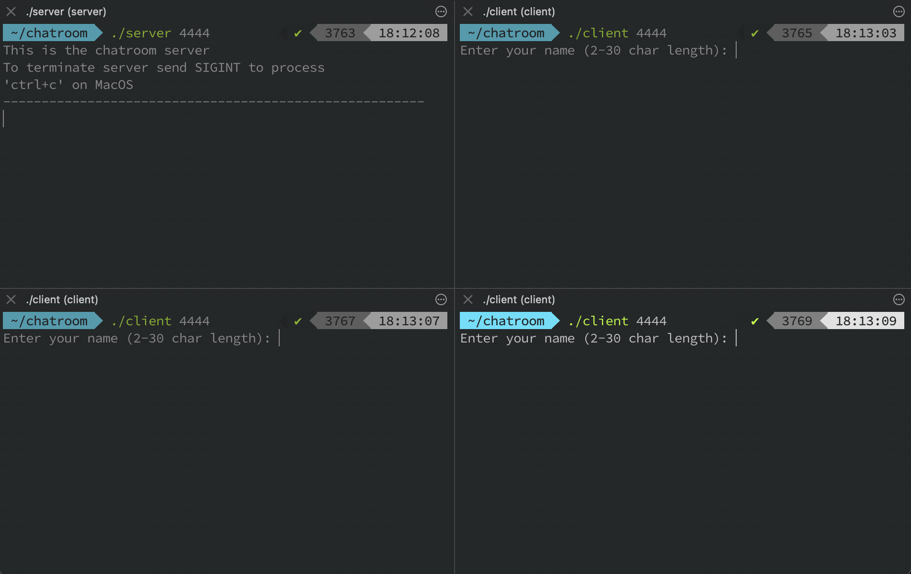
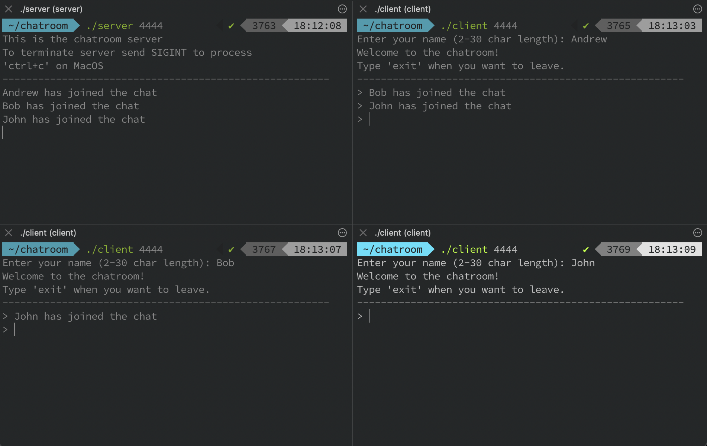
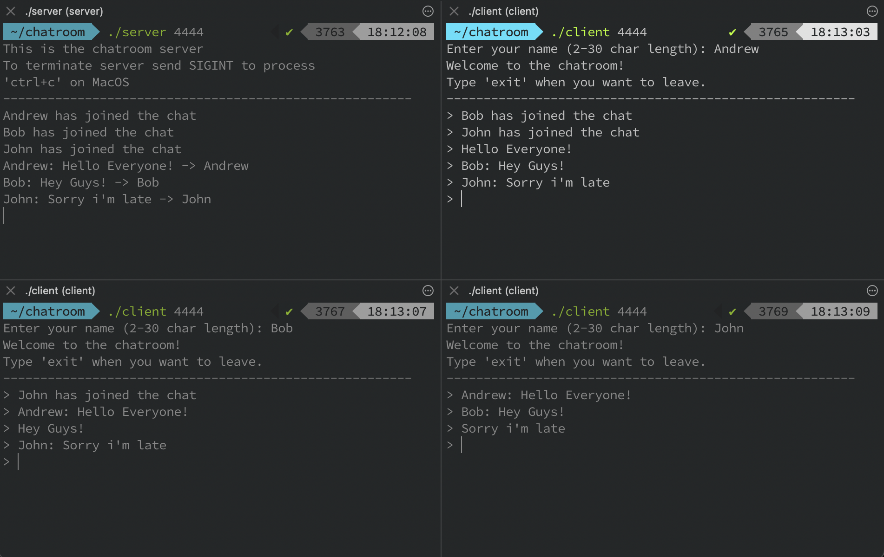
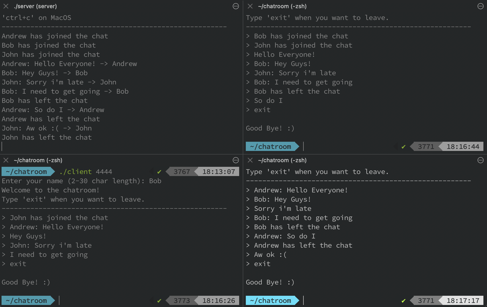
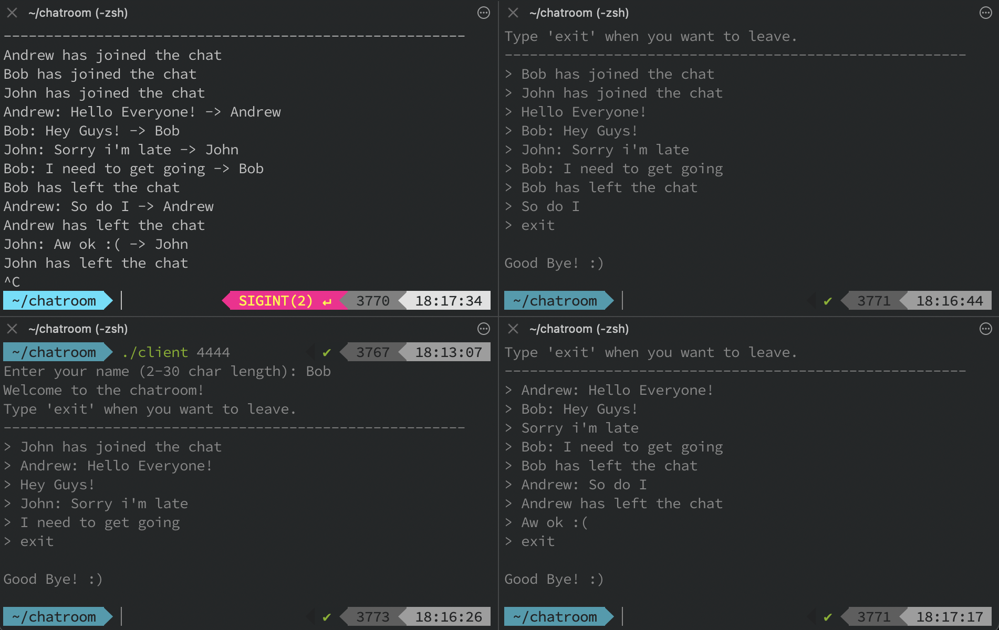

# chatroom

Chatroom application written entirely in C.

[server.c](./server.c) and [client.c](./client.c) can be compiled using the 'make all' command found in the [Makefile](./Makefile).

Compiled versions are also avaiable.

---

After downloading the chatroom file, we will need to open the terminal and go to the chatroom directory.

```bash
cd chatroom
```

We can list the contents to ensure everything is there.

```bash
ls 
```

The executable files provided where compiled using an Apple M1 (ARM based) chip if you are using a different CPU like Intel (x86) the provided executables may not work.

To recompile use the following commands

```bash
make clean
make all
```
'make clean' will remove the existing executable files <br>
'make all' will compile using the .c files

With our executables ready we can open multiple terminal sessions to mimic multiple users.


In one of the terminal sessions we can set up the server using the following command

```bash
./server 4444
```

This will set up the server using port 4444.

Next we can set up a couple clients using the following command

```bash
./client 4444
```

This will set up clients using port 4444.

After commpleting this set up our terminal session should look similar to this



In the example above 3 clients where set-up.

We can now follow the prompts on screen by giving each client a name.



As we can see the server logs all of the activity of the clients.

From here the clients can interact with each other simultaneously.



When a client is ready to leave they can type the following command to end their session.

```bash
exit
```



When we want to close the server we will have to send a 'SIGINT' signal to the process.
On MacOS this can be done by pressing 'ctrl+c'.


